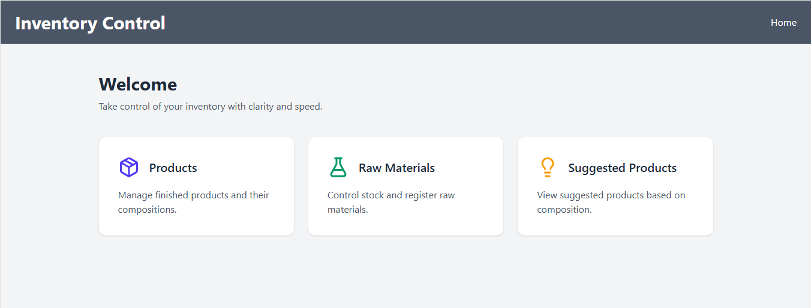
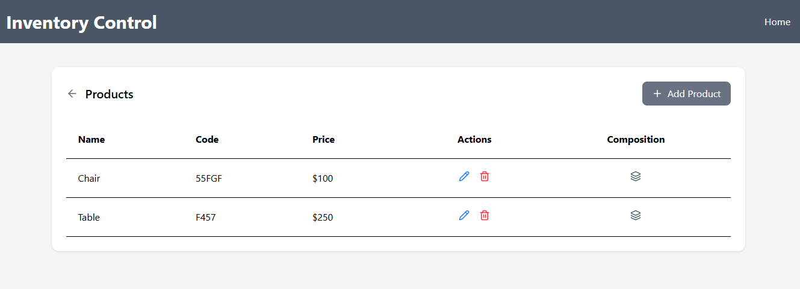
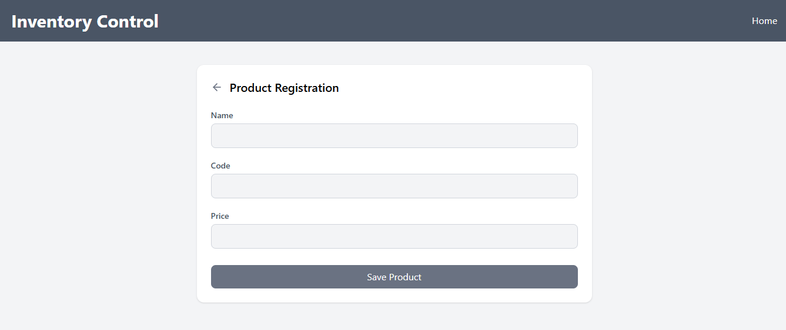
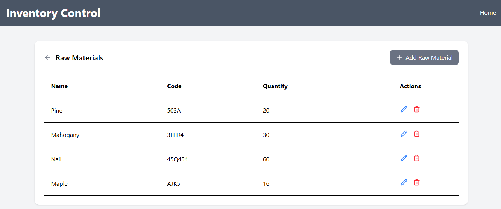
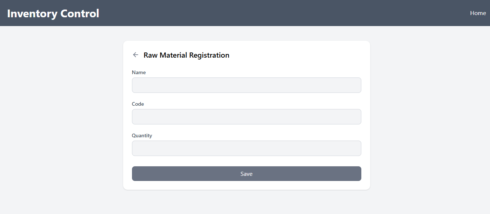
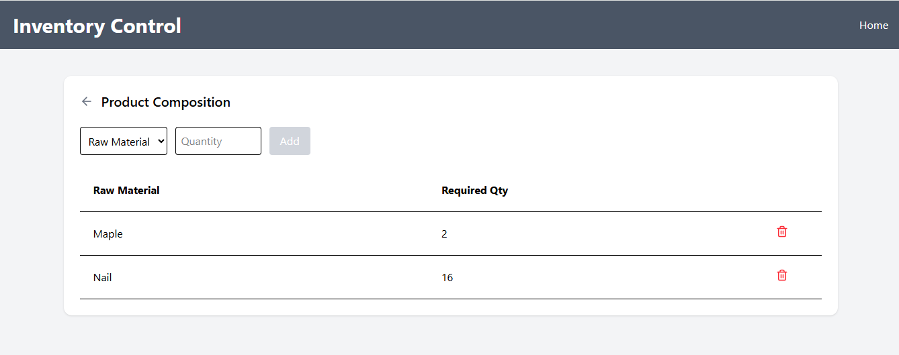
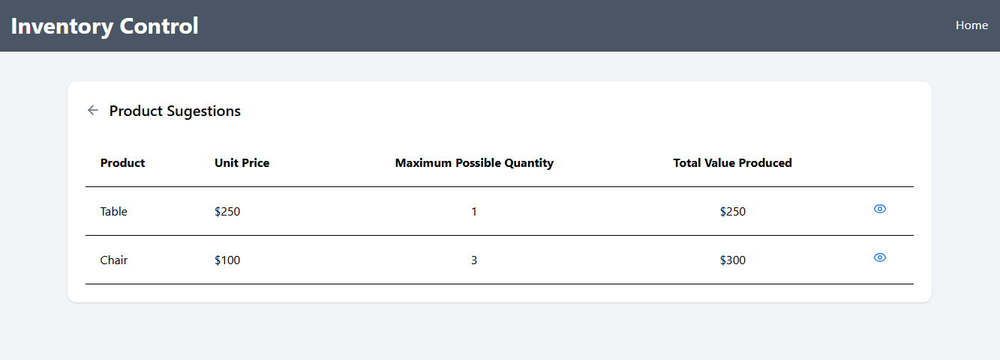

# Inventory Control System

## 📌 About the Project

The project goal is to build a web system capable of managing products and raw materials, as well as suggesting which products can be manufactured based on the available stock of raw materials.

The system follows a separated architecture (API + Frontend), respecting modern web development practices.

---

## 🏗️ Architecture

The application is divided into:

- **Backend (API)** – Java + Spring Boot
- **Frontend** – React + Vite + TailwindCSS
- **Database** – PostgreSQL
- **Deployment**
  - Backend: Render
  - Frontend: Vercel

---

## ⚙️ Technologies Used

### Backend
- Java 17
- Spring Boot
- Spring Data JPA
- PostgreSQL
- JUnit 5
- Mockito

### Frontend
- React
- Vite
- TailwindCSS
- React Router
- React Hot Toast

---

## ✅ Functional Requirements Implemented

### Products
- Create product
- Update product
- Delete product
- List products

### Raw Materials
- Create raw material
- Update raw material
- Delete raw material
- List raw materials

### Product Composition
- Associate raw materials to products
- Define required quantity of each raw material per product
- Update product composition

### Production Suggestion
- Calculate which products can be produced based on stock
- Calculate maximum quantity per product
- Calculate total production value
- Prioritize higher value products

---

## 🧠 Production Suggestion Logic

The system calculates:

- Maximum producible quantity per product: min(rawMaterial.stock / requiredQuantity)

- Total production value: product.price * maxQuantity

- Products are sorted by price (descending), prioritizing higher-value products.

---

## 📸 Screenshots

### Home

### Products

### Raw Materials

### Composition

### Production Suggestion

---

## 🔬 Tests

Backend includes:

- Unit tests for services
- Mocking with Mockito
- Validation of business rules

(Integration and frontend tests can be added as future improvement)

---

## 🌐 Live Application

Frontend: https://inventory-control-teal.vercel.app

⚠️ ⚠️ Note: Backend is deployed on a free tier (render) and may take a few seconds to respond due to cold start. ⚠️ ⚠️

---

🎨 UI

Built with TailwindCSS

Works on Chrome, Firefox and Edge
  
